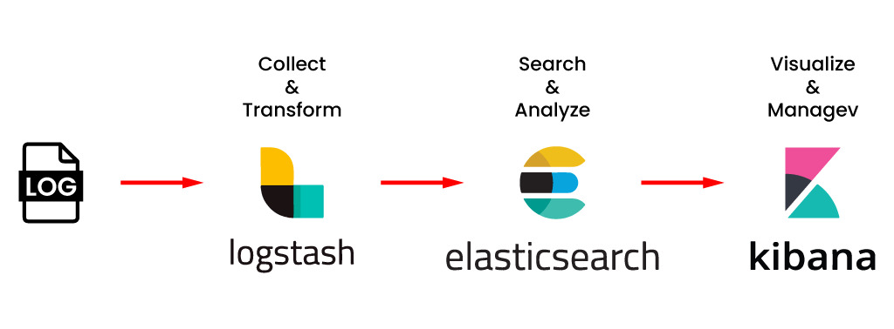
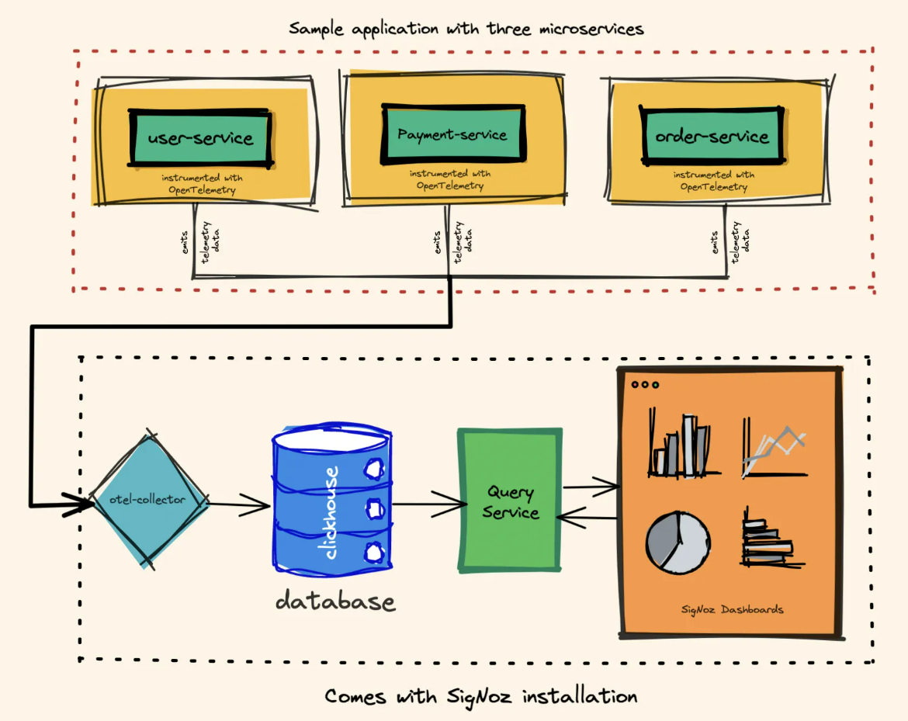

## Observability, Monitoring and Telemetry w/ .NET

This repository provides a overview of observability, monitoring, and telemetry. It also includes a .NET console application designed for practical hands-on experience in these concepts.

### :one: Concepts

🔍✨ **Observability** is the capability to understand the internal state of a system based on the data ir produces, such as log, metrics, and traces. The goal is to answer questions about system behavior, especially in unexpected situations. 

- **Charity Majors** (co-funder of Honeycomb.io) describes observability as "the ability to ask any question about what’s happening inside the system without needing to change the code." in your book called _Observability Engineering_. 

📊🔔 **Monitoring** is the continuous process of collecting and analyzing system data to track its performance and detect potential issues. Monitoring typically focuses on "answering questions we already know" such as whether a service is slow or down.
- In the book _Distributed Systems Observability_ **Cindy Sridharan** distinguishes monitoring from observability. She explains that monitoring is effective for detecting failure conditions and checking the system’s general health, but is insufficient for understanding the deeper internal behavior of a system.

📡📥 **Telemetry** involves collect and transmitting system data (such as logs, metrics, and traces) to a platform for analysis. It also serves as the foundation for both monitoring and observability by supply the necessary data to understand system behavior.

When integrated effectively, these concepts work in harmony:

:one: **Telemetry** provides raw data.

:two: **Monitoring** alerts teams about known patterns or issues.

:three: **Observability** enables deeper investigation to discover the root causes of complex problems.

### :two: Open-Source Tools

#### ELK Stack
The ELK stack is a collection of open-source tools used for searching, analyzing, and visualizing large volumes of data, especially logs generated by systems and applications.


🔄 **logstash** > A data pipeline that collects, processes, and forwards data to Elasticsearch.

🔍 **elasticsearch** > A distributed search and analytics engine for storing and quickly querying data.


📊 **kibana** > A visualization tool that integrates with Elasticsearch to create dashboards and analyze data.

#### Grafana
Grafana is a tool for creating real-time dashboards, allow to visualize data from various sources, like metrics and logs. It's popular in **monitoring** systems because it makes it easy to see trends, detect problems, and set up alerts. Grafana works with many data sources, such as Prometheus, MySQL, and Elasticsearch, making it very versatile.

_Using Grafana with Pods in Kubernetes:_

When running Grafana in a Kubernetes cluster, it’s set up as Pods. 
A Pod is the smallest unit in Kubernetes and represents one or more containers that run together. By deploy Grafana pods, we can take some advantage features:

- **Scalability** > easily add more Grafana instances to handle more users or traffic.
- **Reliability** > Kubernetes can automatically restart or replace Grafana Pods if they go down, keeping dashboards available.
- **Data Persistence** Grafana’s settings, dashboards, and data can be saved on persistent storage in the cluster, so they’re retained even if a Pod restarts.

#### OpenTelemetry
OpenTelemetry is an open-source observability framework designed to collect, process, and export telemetry data from applications and systems, including metrics, logs, and traces. It provides a unified standard for gathering this data, allowing devs and operators to monitor and troubleshoot applications across various environments.

__Key Components__

📜 **Traces** > represent the paths taken by requests as they move through distributed systems. Traces help understand how requests are processed, and aiding in performance optimization and error tracing.

📈 **Metrics** > capture quantitative data about system performance, such as request counts, CPU usage, and memory consumption. Essential for tracking the health and efficiency of applications over time.

🕵️‍♂️ **Logs** > Detailed records of events or messages generated by applications. Logs provide context for understanding application behavior and can offer insights into the cause of issues.

__How OpenTelemetry works?__

OpenTelemetry normalizes how telemetry data is collected and structured. It provides SDKs and APIs for different programming languages, enabling applications to generate telemetry data consistently. This data is then processed through collectors and sent to various backends for analysis, such as Prometheus, Jaeger, Grafana, or Elasticsearch.

The image below shows how OpenTelemetry fits into an application:


_How OpenTelemetry fits within a microservice-based application and OpenTelemetry APM - SigNoz_ - 
Fonte: https://signoz.io/blog/opentelemetry-apm/

### :three: Log Categorization

[From RFC 5424, the Syslog Protocol (IETF) - Page 10](https://www.rfc-editor.org/rfc/rfc5424#page-11) logs are typically categorized into different levels, each serving a specific purpose. The common log levels:

**TRACE** 🕵️‍♂️
This is the most **detailed log level**, capturing fine-grained information about the execution of the code. **Ideal for debugging**, as it allows developers to track the flow of execution in real time.

**DEBUG** 🔍
These logs **provide information that helps in diagnosing problems** but are **less verbose than TRACE** logs. Commonly **used during development** to understand the application's behavior in depth.

**INFO** ℹ️
This level logs **significant events in the application**, such as starting or stopping processes. **Useful for monitoring** the applications health and performance in a production environment.

**WARN** ⚠️
These logs **indicate potentially harmful situations** or unexpected events that do **not necessarily interrupt the program**.
They serve as warnings about issues that might need attention later.

**ERROR** ❌
This level logs **failures** that prevent a particular operation from completing successfully. **Essential for identifying critical problems** that need immediate attention.

**FATAL** ☠️
Logs at this level indicate **severe errors that could cause the application to terminate**.They are **crucial for diagnosing catastrophic failures** that require urgent resolution.


### :four: Log Storage/Generation
There are various approaches to storing and generating logs, each suited to different use cases and infrastructures

| **Approach**                  | **Description**                                                                                      | **Advantages**                                                        | **Disadvantages**                                                      |
|-------------------------------|------------------------------------------------------------------------------------------------------|----------------------------------------------------------------------|----------------------------------------------------------------------|
| **Console**                   | Logs are printed directly to the console where the application is running.                          | Easy to implement and great for debugging during development.       | Logs are ephemeral and lost when the application stops, unsuitable for production. |
| **Files**                     | Logs are written to text files stored on a local filesystem or virtual machines.                    | Provides persistent storage, allowing for historical access to logs. | Requires management of log file sizes and rotation policies to prevent disk space issues. |
| **Sysout (Containers)**       | In containerized environments like Docker, logs can be directed to standard output (stdout) of the container. | Simplifies integration with logging management systems, like ELK.    | Without proper redirection or management, logs may be lost after the container stops. |
| **Database**                  | Logs are stored in databases such as MySQL, PostgreSQL, or MongoDB.                                | Allows for complex queries and analytics, making it easier to analyze logs over time. | Setting up and managing logging in a database can be more complex and might impact performance with large volumes of data. |

### :five: Hands On

1. Prepare Jaeger Setup (I'm using docker setup)
   - Use the following cmd to create a docker container running for Jaeger
    ```cmd
    docker run --name jaeger \
        -p 13133:13133 \ 
        -p 16686:16686 \ %Used by UI Jaeger%
        -p 4317:4317 \ %Used by OpenTelemetry%
        -d \
        --restart=unless-stopped \
        jaegertracing/opentelemetry-all-in-one
    ```
    - To verify if it running successfully, Go to browser and open UI at http://localhost:16686
2. Clone this repo:  https://github.com/kmlyteixeira/observability-hub-dotnet
3. Run `dotnet build` to build this project
4. Run `dotnet run`
5. Open Jaeger UI, select the service called `TestApp`, and press `Find Traces` to see the traces :)

### :books: Learn more
- [YouTube Video: Distributed Systems Observability](https://www.youtube.com/watch?v=gIAavo_MrO0)
- [Azure DevOps Documentation on Logging](https://dev.azure.com/becomex/LAB-TOOLS/_git/DOCS-ARQUITETURA?path=/adr/adr-logging.md&version=GBmaster&_a=preview)
- [OpenTelemetry Documentation](https://opentelemetry.io/docs/)
- [Monitoring Kubernetes Pods Resource Usage with Prometheus and Grafana | Cloud Native Daily](https://www.youtube.com/watch?v=gIAavo_MrO0)
- [RFC 5424, the Syslog Protocol (IETF) - Page 10](https://www.rfc-editor.org/rfc/rfc5424#page-11)
- [Signoz - OpenTelemetry](https://signoz.io/blog/opentelemetry-apm/)
- [E-book Distributed Systems Observability - Cindy Sridharan](https://unlimited.humio.com/rs/756-LMY-106/images/Distributed-Systems-Observability-eBook.pdf)
- [getting-started-jaeger](https://github.com/open-telemetry/opentelemetry-dotnet/tree/main/docs/trace/getting-started-jaeger)
- [serilog-sinks-opentelemetry](https://github.com/serilog/serilog-sinks-opentelemetry/tree/dev)